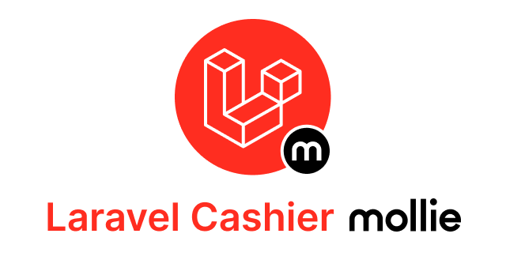

<h2 align="center">Subscription billing with Laravel Cashier for Mollie
</h2>

    

Laravel Cashier provides an expressive, fluent interface to subscriptions using [Mollie](https://www.mollie.com)'s billing services.

### Contributing

Please see [CONTRIBUTING](https://github.com/laravel/cashier-mollie/blob/master/CONTRIBUTING.md) for details.

#### Security

If you discover any security related issues, please email **support@mollie.com** instead of using the issue tracker.

### Credits

- [Mollie.com](https://www.mollie.com)
- [Sander van Hooft](https://github.com/sandervanhooft)
- [All Contributors](https://github.com/laravel/cashier-mollie/contributors)

### License

The MIT License (MIT). Please see [License File](https://github.com/laravel/cashier-mollie/blob/develop/LICENSE.md) for more information.
